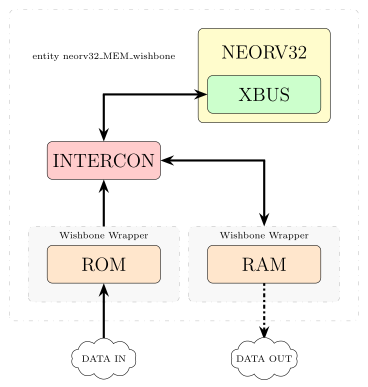

# [Unike267](https://github.com/Unike267) afselerator

- **University**: UPV/EHU.
- **Doctoral Programme**: Engineering Physics.
- **Department**: Electronics Technology.
- **Group**: Digital Electronics Design Group, GDED (GIU21/007).
- **PhD Student**: Unai Sainz-Estebanez.

---

## (a)ctivation (f)unction(s) acc(elerator)

### Stage 1. Design the memory interface

Tasks:

- Design ROM (Input data loaded from a `.hex` file)
  - JOB: `ROM_alone_sim`
- Design ROM Wishbone Wrapper (Verified with VUnit Verification Components)
  - JOB: `ROM_wishbone_alone_sim`
- SETUP: NEORV32 + ROM_WISHBONE + SOFTWARE EXECUTION (Measure latency for reading the entire ROM)
  - JOB: `neorv32_ROM_wishbone_alone_sim`
- Design RAM (Output data stored in a `.hex` file)
  - JOB: `RAM_alone_sim`
- Design RAM Wishbone Wrapper (Verified with VUnit Verification Components)
  - JOB: `RAM_wishbone_alone_sim`
- SETUP: NEORV32 + RAM_WISHBONE + SOFTWARE EXECUTION (Measure latency for writing/reading the entire RAM)
  - JOB: `neorv32_RAM_wishbone_alone_sim`
- SETUP: NEORV32 + ROM_WISHBONE + RAM_WISHBONE + SOFTWARE EXECUTION (Measure latency for writing to RAM what has been read from ROM, then measure RAM read latency | Checker to compare RAM output data with ROM input data)
  - JOB: `neorv32_MEM_wishbone_alone_sim`
  - JOB: `CHECK_neorv32_RAM_wishbone_alone_sim`

#### Scheme of Stage 1

  

